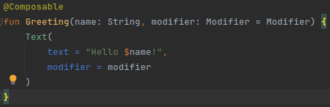
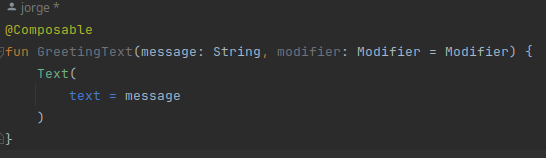
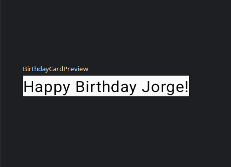

# Tutorial

Haremos una APP que desee un Feliz Cumpleaños paso por paso, partiendo del codigo base aportado por Android Studio , 
haciendo los pertinentes cambios y añadiendo lo que sea necesario.

Este sería el codigo base aportado por Android Studio

Para Empezar cambiaremos el nombre de fun GreetingPreview por una más acorde a nuestro proyecto en este caso por BirthdayCardPreview

pasara a :

Continuamos en incidir el apartado Greeting para así cambiar el nombre Android por el de el usuario, en mi caso Jorge.

Para Saber si los cambios se han realizado dirijase a la esquina superior derecha de su programa y clickee en el apartado Design
para ver de forma grafica los cambios.

aquí se puede ver los cambios realizados.

# Añadir Elementos

Como primer paso eliminariamos el siguiente codigo

Tambien los Greeting ya que nos dan error 

 

Y nos quedaría así el codigo depurado 

Ahora añadimos la funcion GreetingText que nos muestra texto en la IU, *no nos olvidemos del @composable*

Y la llamamos en la funcion JetpackCompose_RecTheme {

para ver el resultado final iriamos de nuevo a Design

